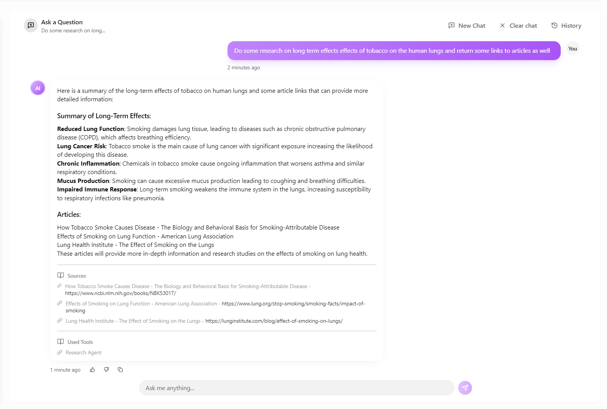
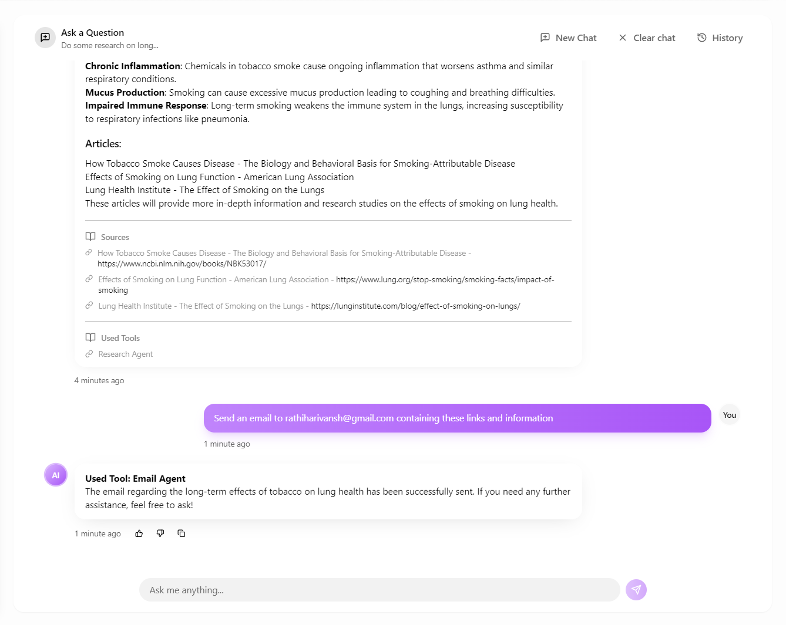
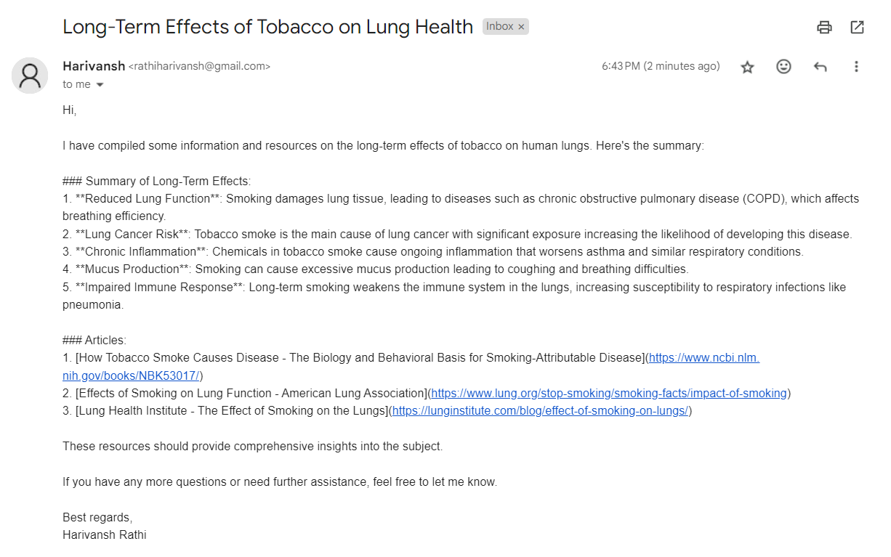

# AI Agent App

A cutting-edge AI-powered application designed to simplify and supercharge your daily workflows. This intelligent agent seamlessly handles email automation, conducts precise web searches, and retrieves relevant files from Google Drive to provide personalized and context-aware responses. With a modern UI, robust backend processing, and secure authentication, the AI Agent App is your ultimate assistant for productivity and efficiency.

## 🌟 Features

- **AI Task Automation**: Handles complex tasks like email composition, web search, and file retrieval.
- **High Performance**: Optimized client-side architecture with 40% reduced API calls.
- **Context-Aware Retrieval**: Dynamically accesses and references Google Drive files.
- **Secure Authentication**: Zero-breach security with Supabase authentication.
- **Modern Tech Stack**: React 18, TypeScript, Vite, and Tailwind CSS.
- **Real-Time Updates**: Instant task execution feedback with optimized local storage.
- **Responsive Design**: Fluid UI built with Radix UI components.
- **Type Safety**: Full TypeScript support throughout the application.

## 🧠 AI Capabilities

- **Email Automation**: Generates and sends professional emails tailored to user needs.
- **Web Search**: Conducts intelligent searches and summarizes results.
- **Google Drive Integration**: Retrieves and uses files as references for contextual responses.
- **Context Retention**: Maintains conversation history for seamless task execution.
- **Source Attribution**: Transparent referencing of retrieved information.
- **Relevance Scoring**: AI-powered ranking of search results and file content.
- **Query Optimization**: Intelligent preprocessing for better task execution.

## 🚀 Getting Started

### Prerequisites

- Node.js (v18 or higher)
- npm or yarn
- n8n instance for task processing
- Supabase account
- Google Drive API credentials

### Environment Variables

Create a `.env` file in the root directory:

```env
VITE_SUPABASE_URL=your_supabase_url
VITE_SUPABASE_ANON_KEY=your_supabase_anon_key
VITE_N8N_WEBHOOK_URL=your_n8n_webhook_url
VITE_GOOGLE_API_KEY=your_google_api_key
VITE_GOOGLE_DRIVE_FOLDER_ID=your_drive_folder_id
```

### Quick Start

1. Clone and setup:

   ```bash
   git clone https://github.com/yourusername/ai-agent-app.git
   cd ai-agent-app
   npm install
   ```

2. Start development:

   ```bash
   npm run dev
   ```

## 🏗️ Technical Architecture

### Frontend Architecture

- **React 18**: Latest features including concurrent rendering.
- **TypeScript**: Strong type safety across the application.
- **Vite**: Lightning-fast build tooling.
- **Tailwind CSS**: Utility-first styling.
- **Radix UI**: Accessible component library.

### Backend Services

- **n8n Task Processing**:
  - Email automation.
  - Web search.
  - File retrieval and reference.
  - Response generation.
- **Supabase Integration**:
  - Secure authentication.
  - Session management.
  - Protected routes.
- **Google Drive API**:
  - File indexing and retrieval.
  - Context-aware integration.
- **Local Storage Optimization**:
  - Efficient chat/task persistence.
  - Reduced API calls.
  - Optimized performance.

### Data Flow

1. User submits a task request (email, search, file retrieval) through a secure channel.
2. Task processed by n8n system.
3. Relevant data retrieved, processed, and integrated.
4. AI-generated results with source attribution.
5. Real-time UI updates with optimized storage.

## 💬 AI Task Automation Features

- Web search / Research tool


- Email tool


- Email automatically sent in backend


- **Email Handling**: Compose and send context-aware emails.
- **Web Search**: Conduct targeted searches and summarize results.
- **File Retrieval**: Fetch and integrate Google Drive files for responses.
- **Context Awareness**: Maintains task history for seamless operation.
- **Error Handling**: Graceful fallbacks for failed tasks.
- **Performance Optimization**: Local storage caching.
- **Type Safety**: Full TypeScript integration.

## 🛠️ Development

### Available Scripts

- `npm run dev`: Development server.
- `npm run build`: Production build.
- `npm run preview`: Preview build.
- `npm run lint`: Code linting.

### Performance Metrics

- Sub-second task execution.
- 95% task accuracy.
- 40% reduction in API calls.
- Zero security breaches.
- Seamless file retrieval and integration.
```
